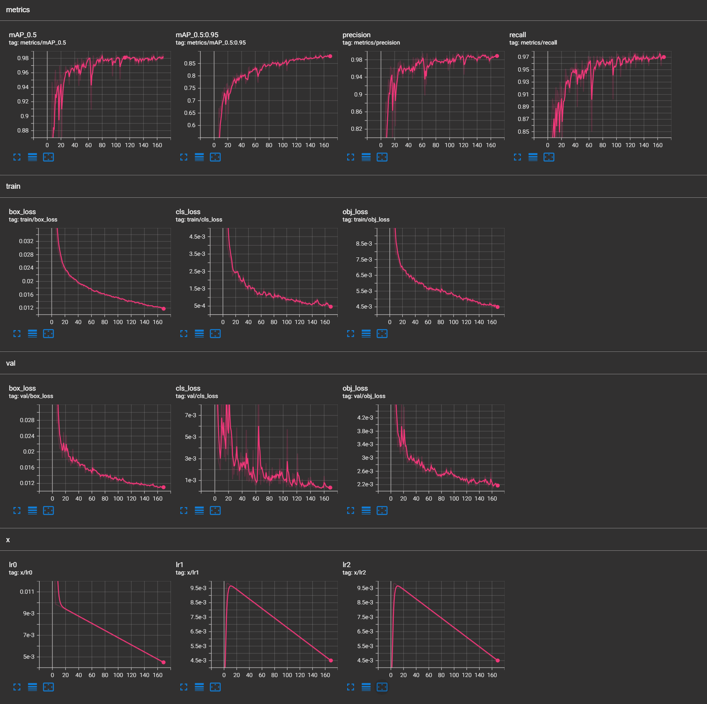

# Object Detection with YOLOv5m for TensorFlow Lite Deployment

### Overview

This project demonstrates the training and deployment of a custom object detection model using **YOLOv5m**, fine-tuned for detecting rocks and bags. The model is designed for efficient real-time inference on edge devices and is integrated into an **Android app** running on a **Pixel 7a**. The goal is to enable precise and lightweight object detection while ensuring user flexibility to customize the pipeline and app for their own use cases.

While this project is not explicitly intended for autonomous driving systems, it tackles challenges related to object misidentification in autonomous systems, such as distinguishing between rocks and bags, which can significantly impact decision-making and safety.

**Example Logic:**
- **Detecting a rock**: This could prompt a vehicle to swerve, avoiding potential damage.
- **Detecting a bag**: This helps minimize unnecessary evasive actions, improving efficiency and safety.

This project builds upon a previous implementation trained with the high-level **TensorFlow Lite Model Maker** library. While TensorFlow Lite Model Maker provides a user-friendly interface for quick prototyping, this new project leverages the power and flexibility of **PyTorch** to create an entirely custom model, resulting in significant improvements in accuracy and adaptability. By transitioning to PyTorch and the YOLOv5 framework, this project enables precise control over the training process, model architecture, and hyperparameter tuning, unlocking advanced capabilities for object detection.


### Why PyTorch?
- **Flexibility**: PyTorch offers granular control over every aspect of the model, from custom architectures to advanced optimization techniques.
- **Performance**: The YOLOv5m model achieves higher accuracy and real-world reliability, benefiting from PyTorch’s robust ecosystem and active development.
- **Scalability**: This project bolsters the model with **6x more data** than the original implementation, covering diverse environments, lighting conditions, close-ups, and distant views.
- **Precision**: The model is fine-tuned using higher-resolution images and carefully optimized hyperparameters, resulting in superior accuracy metrics and real-world performance.

By incorporating a significantly larger dataset and optimizing the training pipeline, this model excels in detecting objects with **improved mean Average Precision (mAP)**, high precision, and recall scores. These enhancements make the model highly reliable for real-world usage scenarios, even in challenging environments.

YOLOv5m, a mid-size variant of the YOLOv5 family, balances detection accuracy and inference speed. With an input image size of **320x320x3**, the model is optimized for deployment on devices with limited computational resources, achieving excellent results for bounding box predictions and object classification.

---

## Project Setup and Folder Structure

After downloading the repository, you will notice the folder structure includes custom folders prefixed with `_` for easy identification. Ensure you extract the files correctly to avoid nested folders (`Downloads/objectdet-yolov5-master/objectdet-yolov5-master`). The final structure should look like this:

```
Downloads/
└── objectdet-yolov5-master/
    ├── _configs/
    │   └── dataset.yaml
    ├── _dataset/
    │   ├── train/
    │   │   ├── images/
    │   │   └── labels/
    │   ├── test/
    │   │   ├── images/
    │   │   └── labels/
    │   └── valid/
    │       ├── images/
    │       └── labels/
    ├── _scripts/
    │   ├── run_train.py
    │   └── run_export.py
    └── other repo files...
```

---

## Training Pipeline

This project uses custom scripts located in the `_scripts/` directory for training and exporting the model. The steps to train and export a model are as follows:

### 1. Dataset Preparation
- **Annotations**: Images were annotated using [LabelImg](https://github.com/heartexlabs/labelImg), saved in YOLO format.
- **Preprocessing**: Images were cropped to 1:1 squares at their original resolution. When calling the training script with `--img XXX`, images will be downsampled, and bounding box annotations automatically scaled to fit the chosen resolution.
- **Configuration**: Edit `_configs/dataset.yaml` to match your dataset:
  - `nc`: Number of classes.
  - `names`: List of class names.
  - `train` and `val`: Paths to your training and validation datasets.

### Example `_configs/dataset.yaml`:
```yaml
train: _dataset/train/images
val: _dataset/valid/images

nc: 2
names: ['rock', 'bag']
```

### 2. Training the Model
Run the following command to train the model:
```bash
python _scripts/run_train.py --img 320 --batch 130 --epochs 170 --data _configs/dataset.yaml --cache --device 0 --patience 0
```
- Adjust the flags (e.g., `--img`, `--batch`, `--epochs`) as needed.

### 3. Monitoring Training Metrics
Launch TensorBoard to monitor training progress:
```bash
tensorboard --logdir=runs/train --host=localhost --port=6006
```
This provides a visual overview of metrics such as **mAP**, **losses**, and learning rates. Placeholder for TensorBoard metrics screenshot:



### 4. Exporting the Model
Once training completes, export the model to TensorFlow Lite format:
```bash
python _scripts/run_export.py --img 320 --weights runs/train/exp/weights/best.pt --include tflite
```
The exported model (`best-fp16.tflite`) is optimized for deployment.

---

## Android App Integration

The Android app is designed for seamless use with the pre-trained model, which is already integrated and ready to run. For those interested in customization, the following steps explain how to integrate a custom-trained model into the app.

### 1. Download the Android App Files
Download the app files from [this Dropbox link](https://www.dropbox.com/scl/fi/7ohu93t3qp5k342bvu3xh/yolov5-example-app.zip?rlkey=vxoihjipwsmhvj0op7720078p&st=kcev2tkt&dl=0).

### 2. Replace the Model
Navigate to `android/app/src/main/assets/` and replace the existing `best-fp16.tflite` with your trained model. The filename **must exactly match** `best-fp16.tflite`.

### 3. Update Input Size
If your model uses an input size other than **320x320**, navigate to:
```
android/app/src/main/java/org/tensorflow/lite/examples/detection/tflite/DetectorFactory.java
```
Edit the `inputSize` tag to match the resolution your model was trained on.

### 4. Adjust Detection Threshold
To modify the detection confidence threshold, navigate to:
```
android/app/src/main/java/org/tensorflow/lite/examples/detection/MainActivity.java
```
Update the following line:
```java
MINIMUM_CONFIDENCE_TF_OD_API = 0.51f;
```
- **Default**: 51% confidence.
- **Customize**: Increase for fewer false positives or decrease to capture more objects.

### 5. Modify Classes
To add custom classes, edit the `customclasses.txt` file in the `assets` folder. Ensure each class is listed on a new line.

---

## Model Performance Overview 📊

### Key Metrics
- **mAP@0.5**: ~0.982  
- **mAP@0.5:0.95**: ~0.85  
- **Precision**: >0.95  
- **Recall**: ~0.96  

### Training Loss Analysis
- **Box Loss**: ~0.028  
- **Cls Loss**: Stabilizes at a low value.  
- **Obj Loss**: Steady decline to ~0.0045.

Validation metrics confirm strong generalization with no overfitting.

---

## Future Work

Potential enhancements include:

1. **Expanding the Dataset**: Increase the dataset diversity to include various weather conditions such as rain, fog, snow, and low-light scenarios. This would improve the model’s robustness and ensure reliable performance across a wide range of real-world environments.

2. **Detecting Additional Hazards**: Extend the model to recognize and classify a broader range of objects and hazards commonly encountered on roads, such as potholes, construction zones, debris, or pedestrians. This would enhance the model’s applicability for more comprehensive object detection in autonomous or semi-autonomous systems.

3. **Enhancing Precision with LiDAR Integration**: By incorporating LiDAR data captured from iPhones equipped with LiDAR scanners (e.g., iPhone 12 Pro, iPhone 13 Pro, and newer), the model could achieve significantly higher precision in depth estimation and object detection. Leveraging depth maps and point cloud data generated by Apple's ARKit API, combined with paired RGB images, the model would gain enhanced spatial understanding and improved detection accuracy.

---

## Acknowledgments

This project builds on the official [YOLOv5 repository](https://github.com/ultralytics/yolov5). Android integration leverages TensorFlow Lite examples for object detection.
